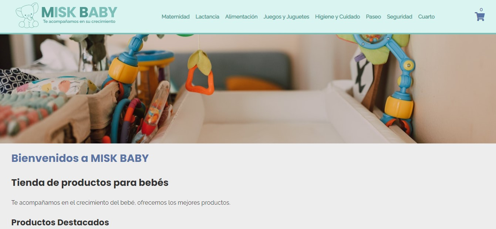

# Misk Baby

Proyecto de una tienda de productos para bebés.


## Screenshot 📷




## Comenzando 🚀

### Pre-requisitos 📋

Editar la constante **phone** en *public/assets/scripts/script.js*, con el número de móvil donde quiera recibir los Whatsapp


```
const phone = '+99999999';
```

Editarlas las constantes **DB_SERVER, DB_USER, DB_PASS, DB_NAME** en *public/api/config/config.php*, con los datos de conexión a la base de datos MySQL


## Construido con 🛠️

* [HTML](https://developer.mozilla.org/es/docs/Web/HTML)
* [CSS](https://developer.mozilla.org/es/docs/Web/CSS)
* [JavaScript](https://developer.mozilla.org/es/docs/Learn/JavaScript)
* [PHP](https://www.php.net/)
* [MySQL](https://www.mysql.com/)
* [API de Whatsapp](https://api.whatsapp.com/)


## Autores ✒️

* **Luciano Rodríguez** - [luckidetrenque](https://github.com/luckidetrenque)
* **Rodrigo Vicedo** - [gitRvicedo](https://github.com/gitRvicedo)

## Licencia 📄

Este proyecto está bajo la Licencia (GPL-3.0) - mira el archivo [LICENSE.md](LICENSE.md) para detalles
